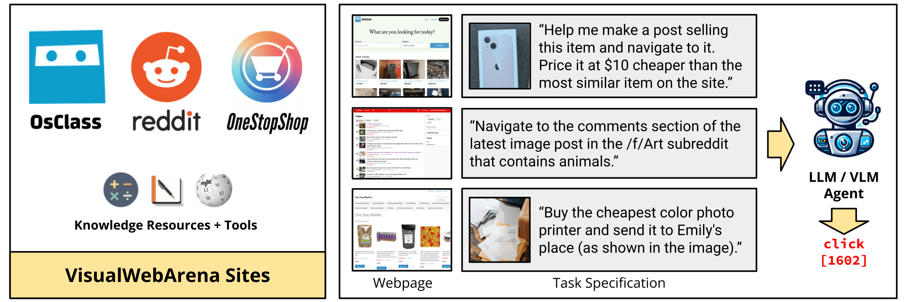
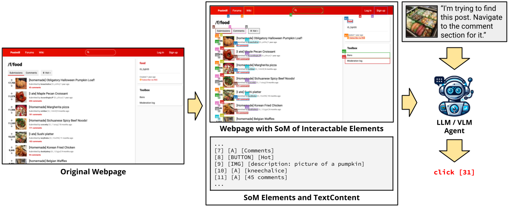

# VisualWebArena: Evaluating Multimodal Agents on Realistic Visual Web Tasks
<!-- <p align="center">
<a href="https://www.python.org/downloads/release/python-3109/"></a>
<a href="https://pre-commit.com/"></a>
<a href="https://github.com/psf/black"></a>
<a href="https://mypy-lang.org/"></a>
<a href="https://beartype.readthedocs.io"></a>
</p> -->

[<a href="https://jykoh.com/vwa">Website</a>] 
[<a href="https://arxiv.org/abs/2401.13649">Paper</a>]

<i>VisualWebArena</i> is a realistic and diverse benchmark for evaluating multimodal autonomous language agents. It comprises of a set of diverse and complex web-based visual tasks that evaluate various capabilities of autonomous multimodal agents. It builds off the reproducible, execution based evaluation introduced in <a href="https://webarena.dev" target="_blank">WebArena</a>.



## TODOs
- [x] Add human trajectories.
- [x] Add GPT-4V + SoM trajectories from our paper.
- [x] Add scripts for end-to-end training and reset of environments.
- [x] Add demo to run multimodal agents on any arbitrary webpage.

## News
- [03/8/2024]: Added the [agent trajectories](https://drive.google.com/file/d/1-tKz5ByWa1-jwtejiFgxli8fZcBPZgAE/view?usp=sharing) of our GPT-4V + SoM agent on the full set of 910 VWA tasks.
- [02/14/2024]: Added a [demo script](run_demo.py) for running the GPT-4V + SoM agent on any task on an arbitrary website.
- [01/25/2024]: GitHub repo released with tasks and scripts for setting up the VWA environments.

## Install
```bash
# Python 3.10 (or 3.11, but not 3.12 cause 3.12 deprecated distutils needed here)
python -m venv venv
source venv/bin/activate
pip install -r requirements.txt
playwright install
pip install -e .
```

You can also run the unit tests to ensure that VisualWebArena is installed correctly:
```
pytest -x
```


## End-to-end Evaluation
1. Setup the standalone environments.
Please check out [this page](environment_docker/README.md) for details.

2. Configurate the urls for each website.
First, export the `DATASET` to be `visualwebarena`:
```bash
export DATASET=visualwebarena
```
Then, set the URL for the websites

```bash
export CLASSIFIEDS="<your_classifieds_domain>:9980"
export CLASSIFIEDS_RESET_TOKEN="4b61655535e7ed388f0d40a93600254c"  # Default reset token for classifieds site, change if you edited its docker-compose.yml
export SHOPPING="<your_shopping_site_domain>:7770"
export REDDIT="<your_reddit_domain>:9999"
export WIKIPEDIA="<your_wikipedia_domain>:8888"
export HOMEPAGE="<your_homepage_domain>:4399"
```

In addition, if you want to run on the original WebArena tasks, make sure to also set up the [CMS](https://github.com/web-arena-x/webarena/blob/main/environment_docker/README.md#e-commerce-content-management-system-cms), [GitLab](https://github.com/web-arena-x/webarena/blob/main/environment_docker/README.md#gitlab-website), and [map](https://github.com/web-arena-x/webarena/blob/main/environment_docker/README.md#map) environments, and then set their respective environment variables:
```bash
export SHOPPING_ADMIN="<your_e_commerce_cms_domain>:7780/admin"
export GITLAB="<your_gitlab_domain>:8023"
export MAP="<your_map_domain>:3000"
```

3. Generate config files for each test example:
```bash
python scripts/generate_test_data.py
```
You will see `*.json` files generated in the [config_files](./config_files) folder. Each file contains the configuration for one test example.

4. Obtain and save the auto-login cookies for all websites:
```
bash prepare.sh
```

5. Set up API keys.

If using OpenAI models, set a valid OpenAI API key (starting with `sk-`) as the environment variable:
```
export OPENAI_API_KEY=your_key
```

If using Gemini, first install the [gcloud CLI](https://cloud.google.com/sdk/docs/install). Configure the API key by authenticating with Google Cloud:
```
gcloud auth login
gcloud config set project <your_project_name>
```

6. Launch the evaluation. For example, to reproduce our GPT-3.5 captioning baseline:
```bash
python run.py \
  --instruction_path agent/prompts/jsons/p_cot_id_actree_3s.json \
  --test_start_idx 0 \
  --test_end_idx 1 \
  --result_dir <your_result_dir> \
  --test_config_base_dir=config_files/vwa/test_classifieds \
  --model gpt-3.5-turbo-1106 \
  --observation_type accessibility_tree_with_captioner
```
This script will run the first Classifieds example with the GPT-3.5 caption-augmented agent. The trajectory will be saved in `<your_result_dir>/0.html`. Note that the baselines that include a captioning model run on GPU by default (e.g., BLIP-2-T5XL as the captioning model will take up approximately 12GB of GPU VRAM).

## GPT-4V + SoM Agent


To run the GPT-4V + SoM agent we proposed in our paper, you can run evaluation with the following flags:
```bash
python run.py \
  --instruction_path agent/prompts/jsons/p_som_cot_id_actree_3s.json \
  --test_start_idx 0 \
  --test_end_idx 1 \
  --result_dir <your_result_dir> \
  --test_config_base_dir=config_files/vwa/test_classifieds \
  --model gpt-4-vision-preview \
  --action_set_tag som  --observation_type image_som
```

To run Gemini models, you can change the provider, model, and the max_obs_length (as Gemini uses characters instead of tokens for inputs):
```bash
python run.py \
  --instruction_path agent/prompts/jsons/p_som_cot_id_actree_3s.json \
  --test_start_idx 0 \
  --test_end_idx 1 \
  --max_steps 1 \
  --result_dir <your_result_dir> \
  --test_config_base_dir=config_files/vwa/test_classifieds \
  --provider google  --model gemini --mode completion  --max_obs_length 15360 \
  --action_set_tag som  --observation_type image_som
```

If you'd like to reproduce the results from our paper, we have also provided scripts in `scripts/` to run the full evaluation pipeline on each of the VWA environments. For example, to reproduce the results from the Classifieds environment, you can run:

```bash
bash scripts/run_classifieds_som.sh
```

### Agent Trajectories

To facilitate analysis and evals, we have also released the trajectories of the GPT-4V + SoM agent on the full set of 910 VWA tasks [here](https://drive.google.com/file/d/1-tKz5ByWa1-jwtejiFgxli8fZcBPZgAE/view?usp=sharing). It consists of .html files that record the agent's observations and output at each step of the trajectory.

### Demo


We have also prepared a demo for you to run the agents on your own task on an arbitrary webpage. An example is shown above where the agent is tasked to find the best Thai restaurant in Pittsburgh.

After following the setup instructions above and setting the OpenAI API key (the other environment variables for website URLs aren't really used, so you should be able to set them to some dummy variable), you can run the GPT-4V + SoM agent with the following command:
```bash
python run_demo.py \
  --instruction_path agent/prompts/jsons/p_som_cot_id_actree_3s.json \
  --start_url "https://www.amazon.com" \
  --image "https://media.npr.org/assets/img/2023/01/14/this-is-fine_wide-0077dc0607062e15b476fb7f3bd99c5f340af356-s1400-c100.jpg" \
  --intent "Help me navigate to a shirt that has this on it." \
  --result_dir demo_test_amazon \
  --model gpt-4-vision-preview \
  --action_set_tag som  --observation_type image_som \
  --render
```

This tasks the agent to find a shirt that looks like the provided image (the "This is fine" dog) from Amazon. Have fun!


## Human Evaluations

We collected human trajectories on 233 tasks (one from each template type) and the Playwright recording files are provided [here](https://drive.google.com/drive/folders/1S_fDzB1VUTwUphWPKZ0DdjJOAXjGz94g). These are the same tasks reported in our paper (with a human success rate of ~89%). You can view the HTML pages, actions, etc., by running `playwright show-trace <example_id>.zip`. The `example_id` follows the same structure as the examples from the corresponding site in `config_files/`.


## Citation
If you find our environment or our models useful, please consider citing <a href="https://jykoh.com/vwa" target="_blank">VisualWebArena</a> as well as <a href="https://webarena.dev/" target="_blank">WebArena</a>:
```
@article{koh2024visualwebarena,
  title={VisualWebArena: Evaluating Multimodal Agents on Realistic Visual Web Tasks},
  author={Koh, Jing Yu and Lo, Robert and Jang, Lawrence and Duvvur, Vikram and Lim, Ming Chong and Huang, Po-Yu and Neubig, Graham and Zhou, Shuyan and Salakhutdinov, Ruslan and Fried, Daniel},
  journal={arXiv preprint arXiv:2401.13649},
  year={2024}
}

@article{zhou2024webarena,
  title={WebArena: A Realistic Web Environment for Building Autonomous Agents},
  author={Zhou, Shuyan and Xu, Frank F and Zhu, Hao and Zhou, Xuhui and Lo, Robert and Sridhar, Abishek and Cheng, Xianyi and Bisk, Yonatan and Fried, Daniel and Alon, Uri and others},
  journal={ICLR},
  year={2024}
}
```

## Acknowledgements

Our code is heavily based off the <a href="https://github.com/web-arena-x/webarena">WebArena codebase</a>.
