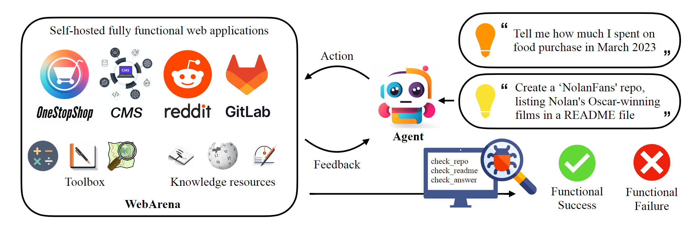

# WebArena: A Realistic Web Environment for Building Autonomous Agents
<p align="center">
    
    <br>
    <b>WebArena is a standalone, self-hostable web environment for building autonomous agents</b>
</p>


<p align="center">
<a href="https://www.python.org/downloads/release/python-3109/"></a>
<a href="https://pre-commit.com/"></a>
<a href="https://github.com/psf/black"></a>
<a href="https://mypy-lang.org/"></a>
<a href="https://beartype.readthedocs.io"></a>
</p>

<p align="center">
<a href="https://webarena.dev/">Website</a> •
<a href="https://arxiv.org/abs/2307.13854">Paper</a> •
<a href="https://docs.google.com/spreadsheets/d/1M801lEpBbKSNwP-vDBkC_pF7LdyGU1f_ufZb_NWNBZQ/edit?usp=sharing">Leaderboard</a>
</p>



## Quick Walkthrough
Check out [this script](minimal_example.py) for a quick walkthrough on how to set up the browser environment and interact with it using the demo sites we hosted. This script is only for education purpose, to perform *reproducible* experiments, please check out the next section. In the nutshell, using WebArena is very similar to using OpenAI Gym. The following code snippet shows how to interact with the environment.
```python
from browser_env import ScriptBrowserEnv, create_id_based_action
# init the environment
env = ScriptBrowserEnv(
    headless=False,
    observation_type="accessibility_tree",
    current_viewport_only=True,
    viewport_size={"width": 1280, "height": 720},
)
# prepare the environment for a configuration defined in a json file
config_file = "config_files/0.json"
obs, info = env.reset(options={"config_file": config_file})
# get the text observation (e.g., html, accessibility tree) through obs["text"]

# create a random action
id = random.randint(0, 1000)
action = create_id_based_action(f"click [id]")

# take the action
obs, _, terminated, _, info = env.step(action)
```
## WebArena Environment Setup
1. Setup the standalone environment.
Please check out [this page](environment_docker/README.md) for details.

2. Export the `DATASET` to be `webarena`:
```bash
export DATASET=webarena
```

3. Configurate the urls for each website.
```bash
export SHOPPING="<your_shopping_site_domain>:7770"
export SHOPPING_ADMIN="<your_e_commerce_cms_domain>:7780/admin"
export REDDIT="<your_reddit_domain>:9999"
export GITLAB="<your_gitlab_domain>:8023"
export MAP="<your_map_domain>:3000"
export WIKIPEDIA="<your_wikipedia_domain>:8888/wikipedia_en_all_maxi_2022-05/A/User:The_other_Kiwix_guy/Landing"
export HOMEPAGE="<your_homepage_domain>:4399" # this is a placeholder
```

> You are encouraged to update the environment variables in [github workflow](.github/workflows/tests.yml#L7) to ensure the correctness of unit tests

4. Generate config file for each test example
```bash
python scripts/generate_test_data.py
```
You will see `*.json` files generated in [config_files](./wa/config_files) folder. Each file contains the configuration for one test example.

## Develop Your Prompt-based Agent
1. Define the prompts. We provide two baseline agents whose corresponding prompts are listed [here](./agent/prompts/raw). Each prompt is a dictionary with the following keys:
```python
prompt = {
  "intro": <The overall guideline which includes the task description, available action, hint and others>,
  "examples": [
    (
      example_1_observation,
      example_1_response
    ),
    (
      example_2_observation,
      example_2_response
    ),
    ...
  ],
  "template": <How to organize different information such as observation, previous action, instruction, url>,
  "meta_data": {
    "observation": <Which observation space the agent uses>,
    "action_type": <Which action space the agent uses>,
    "keywords": <The keywords used in the template, the program will later enumerate all keywords in the template to see if all of them are correctly replaced with the content>,
    "prompt_constructor": <Which prompt construtor is in used, the prompt constructor will construct the input feed to an LLM and extract the action from the generation, more details below>,
    "action_splitter": <Inside which splitter can we extract the action, used by the prompt constructor>
    }
  }
```

2. Implement the prompt constructor. An example prompt constructor using Chain-of-thought/ReAct style reasoning is [here](./agent/prompts/prompt_constructor.py#L184). The prompt constructor is a class with the following methods:
* `construct`: construct the input feed to an LLM
* `_extract_action`: given the generation from an LLM, how to extract the phrase that corresponds to the action
