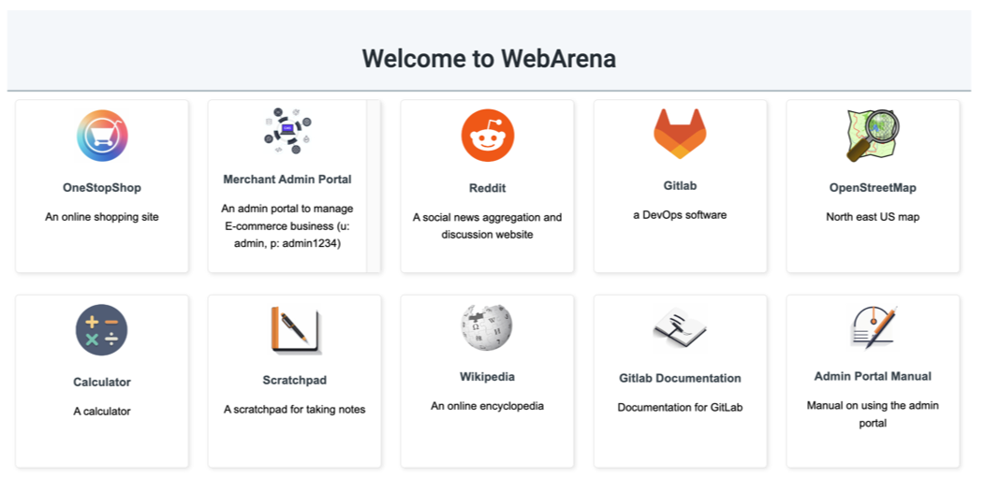

# Docker for WebArena Websites
This REAME file host the instructions for our Docker images and quick start guide for starting up websites used in VisualWebArena.

## Pre-installed Amazon Machine Image (Recommended)

We provide an AMI which has the environments for **both** VisualWebArena and WebArena websites pre-installed. You can use the AMI to start a new EC2 instance:

```
AMI Information: find in console, EC2 - AMI Catalog
Region: us-east-2
Name: webarena-x
ID: ami-080f6d73cfce497a1
```

1. Create a security group that allows all inbound traffic.

2. Create an instance (recommended type: t3a.xlarge, 1000GB EBS root volume) from the webarena-x AMI. Use the security group just created and remember to select SSH key-pair.

3. Create an Elastic IP and bind to the instance to associate the instance with a static IP and hostname. Take note of the hostname, usually in the form of "ec2-xx-xx-xx-xx.us-east-2.compute.amazonaws.com". This will be used as "<your-server-hostname>" in the following commands.

4. Log into the server, start all dockers by:
```bash
### For VWA:
docker start shopping
docker start forum
docker start kiwix33
cd classifieds_docker_compose
vi classifieds_docker_compose/docker-compose.yml  # Set CLASSIFIEDS to your site url `http://<your-server-hostname>:9980/`, and change the reset token if required
docker compose up --build -d

### For WebArena:
docker start gitlab
docker start shopping_admin
cd /home/ubuntu/openstreetmap-website/
docker compose start
```

:clock1: wait ~1 min to wait all services to start

5. Run
```bash
### For VWA:
docker exec classifieds_db mysql -u root -ppassword osclass -e 'source docker-entrypoint-initdb.d/osclass_craigslist.sql'  # Populate DB with content

docker exec shopping /var/www/magento2/bin/magento setup:store-config:set --base-url="http://<your-server-hostname>:7770" # no trailing slash
docker exec shopping mysql -u magentouser -pMyPassword magentodb -e  'UPDATE core_config_data SET value="http://<your-server-hostname>:7770/" WHERE path = "web/secure/base_url";'
docker exec shopping /var/www/magento2/bin/magento cache:flush

# Disable re-indexing of products
docker exec shopping /var/www/magento2/bin/magento indexer:set-mode schedule catalogrule_product
docker exec shopping /var/www/magento2/bin/magento indexer:set-mode schedule catalogrule_rule
docker exec shopping /var/www/magento2/bin/magento indexer:set-mode schedule catalogsearch_fulltext
docker exec shopping /var/www/magento2/bin/magento indexer:set-mode schedule catalog_category_product
docker exec shopping /var/www/magento2/bin/magento indexer:set-mode schedule customer_grid
docker exec shopping /var/www/magento2/bin/magento indexer:set-mode schedule design_config_grid
docker exec shopping /var/www/magento2/bin/magento indexer:set-mode schedule inventory
docker exec shopping /var/www/magento2/bin/magento indexer:set-mode schedule catalog_product_category
docker exec shopping /var/www/magento2/bin/magento indexer:set-mode schedule catalog_product_attribute
docker exec shopping /var/www/magento2/bin/magento indexer:set-mode schedule catalog_product_price
docker exec shopping /var/www/magento2/bin/magento indexer:set-mode schedule cataloginventory_stock

### For WebArena:
docker exec shopping_admin /var/www/magento2/bin/magento setup:store-config:set --base-url="http://<your-server-hostname>:7780"
docker exec shopping_admin mysql -u magentouser -pMyPassword magentodb -e  'UPDATE core_config_data SET value="http://<your-server-hostname>:7780/" WHERE path = "web/secure/base_url";'
docker exec shopping_admin /var/www/magento2/bin/magento cache:flush

docker exec gitlab sed -i "s|^external_url.*|external_url 'http://<your-server-hostname>:8023'|" /etc/gitlab/gitlab.rb
docker exec gitlab gitlab-ctl reconfigure
```

You should be able to access your environment websites now, and stop reading.
However, if you are unable to use AWS AMI, read below to set up on your own machine.

### Environment reset
After evaluating the examples, reset the environment to the initial state
```bash
### For VWA:
bash scripts/reset_reddit.sh
bash reset_shopping.sh
curl -X POST http://<your-server-hostname>:9980/index.php?page=reset -d "token=4b61655535e7ed388f0d40a93600254c"

### For WebArena:
docker stop shopping_admin gitlab
docker remove shopping_admin gitlab
docker run --name shopping_admin -p 7780:80 -d shopping_admin_final_0719
docker run --name gitlab -d -p 8023:8023 gitlab-populated-final-port8023 /opt/gitlab/embedded/bin/runsvdir-start
<repeat the commands in step 5 above>
```

## Classifieds Website

Download the image zip from one of the following:
- https://drive.google.com/file/d/1m79lp84yXfqdTBHr6IS7_1KkL4sDSemR/view
- https://archive.org/download/classifieds_docker_compose

```
unzip classifieds_docker_compose.zip
cd classifieds_docker_compose
vi classifieds_docker_compose/docker-compose.yml  # Set CLASSIFIEDS to your site url `http://<your-server-hostname>:9980/`, and change the reset token if required
docker compose up --build -d
# Wait for compose up to finish. This may take a while on the first launch as it downloads several large images from dockerhub.
docker exec classifieds_db mysql -u root -ppassword osclass -e 'source docker-entrypoint-initdb.d/osclass_craigslist.sql'  # Populate DB with content
```
Now you can visit `http://<your-server-hostname>:9980`.


## Shopping Website (OneStopShop)

The Shopping Website follows the same setup as the same environment used in WebArena. Download the image tar from the following mirrors:
- https://drive.google.com/file/d/1gxXalk9O0p9eu1YkIJcmZta1nvvyAJpA/view?usp=sharing
- https://archive.org/download/webarena-env-shopping-image
- http://metis.lti.cs.cmu.edu/webarena-images/shopping_final_0712.tar

```
docker load --input shopping_final_0712.tar
docker run --name shopping -p 7770:80 -d shopping_final_0712
# wait ~1 min to wait all services to start

docker exec shopping /var/www/magento2/bin/magento setup:store-config:set --base-url="http://<your-server-hostname>:7770" # no trailing slash
docker exec shopping mysql -u magentouser -pMyPassword magentodb -e  'UPDATE core_config_data SET value="http://<your-server-hostname>:7770/" WHERE path = "web/secure/base_url";'
docker exec shopping /var/www/magento2/bin/magento cache:flush

# Disable re-indexing of products
docker exec shopping /var/www/magento2/bin/magento indexer:set-mode schedule catalogrule_product
docker exec shopping /var/www/magento2/bin/magento indexer:set-mode schedule catalogrule_rule
docker exec shopping /var/www/magento2/bin/magento indexer:set-mode schedule catalogsearch_fulltext
docker exec shopping /var/www/magento2/bin/magento indexer:set-mode schedule catalog_category_product
docker exec shopping /var/www/magento2/bin/magento indexer:set-mode schedule customer_grid
docker exec shopping /var/www/magento2/bin/magento indexer:set-mode schedule design_config_grid
docker exec shopping /var/www/magento2/bin/magento indexer:set-mode schedule inventory
docker exec shopping /var/www/magento2/bin/magento indexer:set-mode schedule catalog_product_category
docker exec shopping /var/www/magento2/bin/magento indexer:set-mode schedule catalog_product_attribute
docker exec shopping /var/www/magento2/bin/magento indexer:set-mode schedule catalog_product_price
docker exec shopping /var/www/magento2/bin/magento indexer:set-mode schedule cataloginventory_stock
```
Now you can visit `http://<your-server-hostname>:7770`.


## Social Forum Website (Reddit)

The Wikipedia Website follows the same setup procedure as the environment used in WebArena. Download the image tar from the following mirrors:
- https://drive.google.com/file/d/17Qpp1iu_mPqzgO_73Z9BnFjHrzmX9DGf/view?usp=sharing
- https://archive.org/download/postmill-populated-exposed-withimg
- http://metis.lti.cs.cmu.edu/webarena-images/postmill-populated-exposed-withimg.tar

```
docker load --input postmill-populated-exposed-withimg.tar
docker run --name forum -p 9999:80 -d postmill-populated-exposed-withimg
```
Now you can visit `http://<your-server-hostname>:9999/`.


## Wikipedia Website

The Wikipedia Website follows the same setup procedure as the environment used in WebArena. Download the data from the following mirrors:
- https://drive.google.com/file/d/1Um4QLxi_bGv5bP6kt83Ke0lNjuV9Tm0P/view?usp=sharing
- https://archive.org/download/webarena-env-wiki-image
- http://metis.lti.cs.cmu.edu/webarena-images/wikipedia_en_all_maxi_2022-05.zim

```
docker run -d --name=wikipedia --volume=<your-path-to-downloaded-folder>/:/data -p 8888:80 ghcr.io/kiwix/kiwix-serve:3.3.0 wikipedia_en_all_maxi_2022-05.zim
```
Now you can visit `http://<your-server-hostname>:8888/wikipedia_en_all_maxi_2022-05/A/User:The_other_Kiwix_guy/Landing`.


## Homepage

The homepage lists all available websites which the agent can use to navigate to different sites.


To host the homepage, first change `<your-server-hostname>` to the corresponding server hostnames in [webarena-homepage/templates/index.html](webarena-homepage/templates/index.html)
```bash
# Define your actual server hostname
YOUR_ACTUAL_HOSTNAME=""
# Remove trailing / if it exists
YOUR_ACTUAL_HOSTNAME=${YOUR_ACTUAL_HOSTNAME%/}
# Use sed to replace placeholder in the HTML file
perl -pi -e "s|<your-server-hostname>|${YOUR_ACTUAL_HOSTNAME}|g" webarena-homepage/templates/index.html
```

Then run
```
cd webarena_homepage
flask run --host=0.0.0.0 --port=4399
```
The homepage will be available at `http://<your-server-hostname>:4399`.
